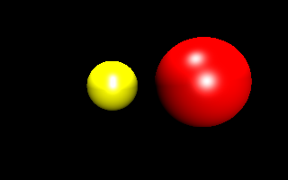
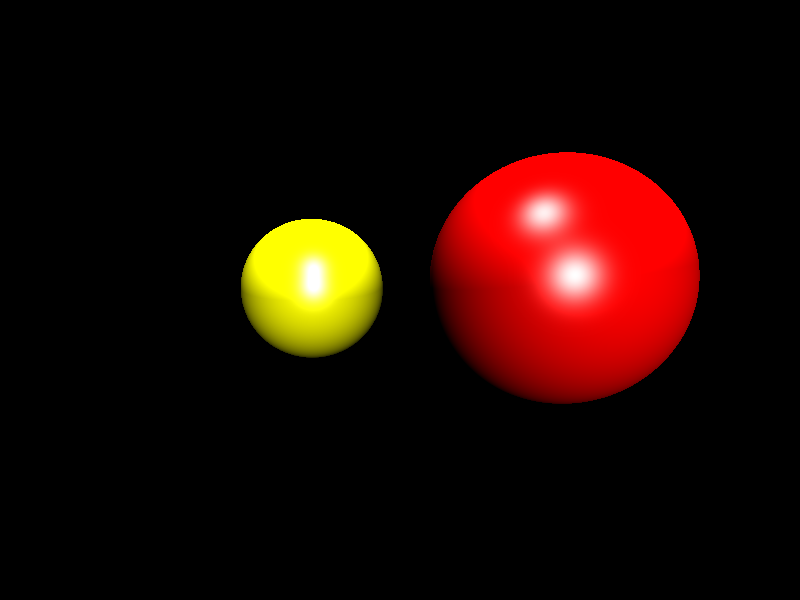
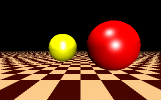
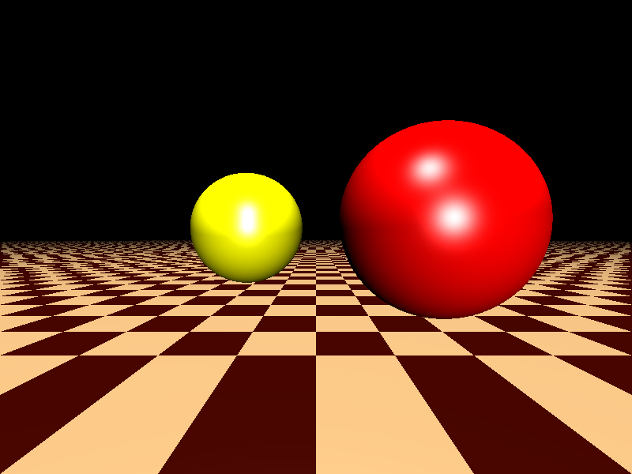
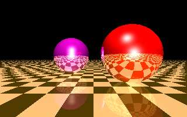
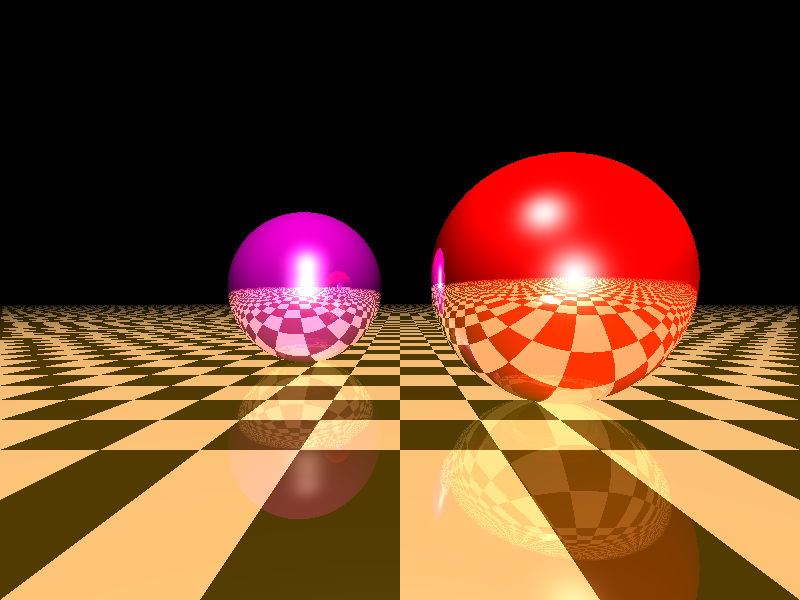
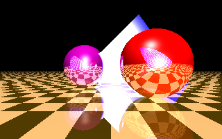
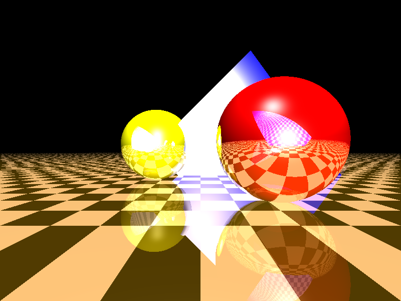
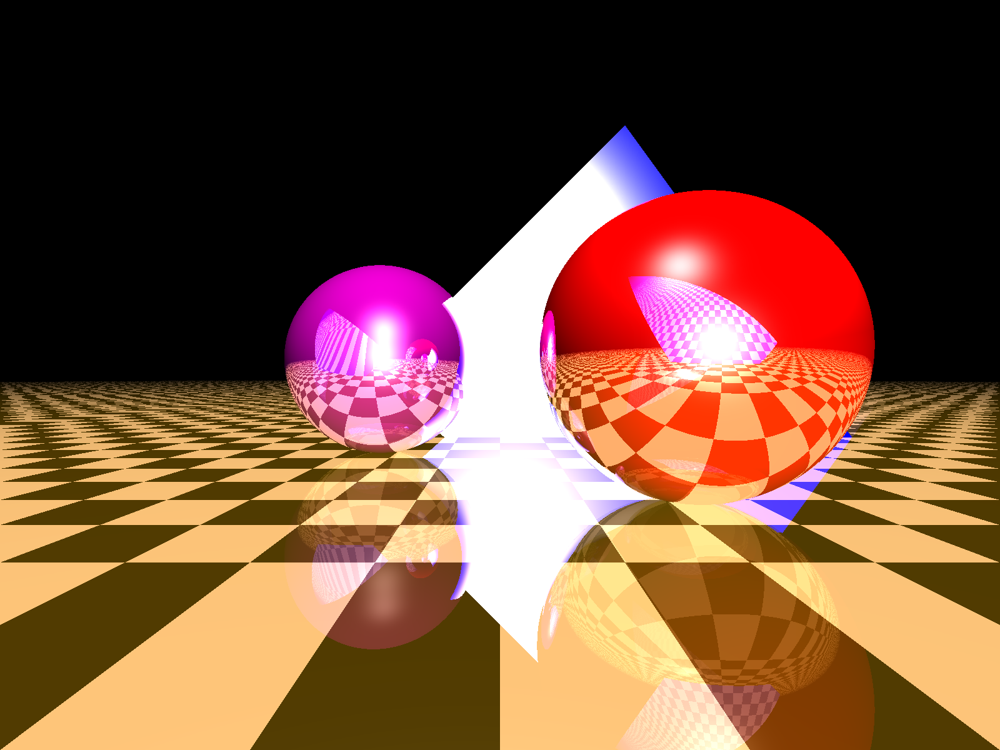

# Praktikum 2

## Aufgabe 1
### Blinn-Phong-Shading 

---

320x200

 

---

800x600

 

---

1600x1200

 

---

## Mit Zusatzaufgabe: Schachbrett

---

320x200

 

---

800x600

 

---

1600x1200

 

---

## Aufgabe 2
### reflektierter Strahl

---

320x200

 

---

800x600

 

---

1600x1200

 

---

## Aufgabe 3
### Dreieck

---

320x200

 

---

---

800x600

 

---

1600x1200

 

---

